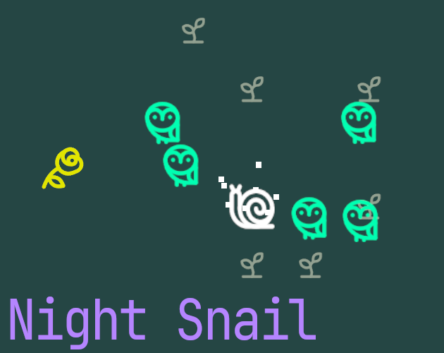

# Night Snail

A small video game in which you guide a snail through a forest at night, avoiding starlight and collecting roses.  
The path you take becomes poetry and music.

夜の森で、スネイルを動かして星の光を避けたり薔薇を集めたりする小さなビデオゲーム。  
プレイの軌跡が、詩と音楽になります。

## Play

[Play / Download on itch.io]([ITCH.IOのURL](https://aratatakagi.itch.io/night-snail))

## About

約100秒のプレイのなかで、移動、音楽、言葉がそれぞれ別の規則で動きながら影響し合います。

Over the course of roughly 100 seconds of play, movement, music, and language each follow their own rules while influencing one another.

日本語 / English 対応。
Web / Windows / macOS。

## Trailer

[Watch the trailer on YouTube](https://youtu.be/mFd1jYPxN1M)
